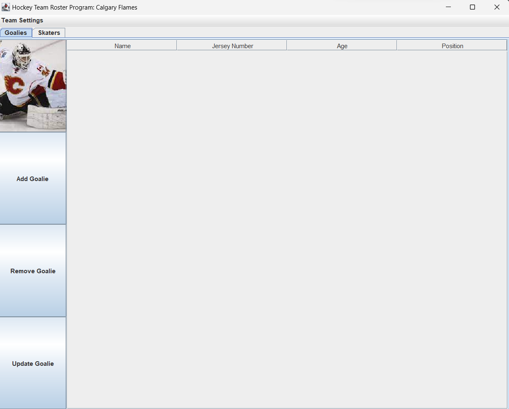
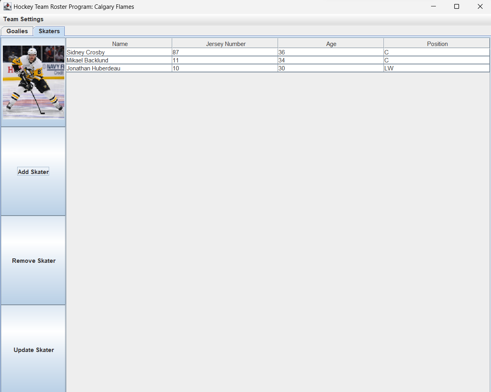
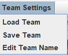

# My Personal Project - Ryan Saloff
## Topic: NHL Team Customizable Statistics Application

In this project, I plan to design an application to organize statistics for a professional hockey team.
The aim of this application is to allow a user to record and update statistics for each player on a team.
A list of such statistics include:

**Player Stats:**
- Games Played
- Goals
- Assists
- Points
- Plus/Minus
- Penalty Minutes 
- Time on Ice Per Game 
- Hits
- Blocked Shots
- Shots
- Shooting %
- Power Play Goals
- Short Handed Goals
- Faceoffs Taken
- Faceoffs Won
- Faceoff Win %
- Shootout Attempts
- Shootout Goals
- Shootout Goals %

**Goalie Stats:**
- Games Played
- Games Started
- Wins
- Losses
- Overtime Losses
- Shutouts
- Saves
- Save %
- Shots Against
- Goals Against
- Goals Against Average
- Penalty Minutes
- Shootout Shots Against
- Shootout Saves
- Shootout Save %
- Goals
- Assists

As a result, this application is designed to be used by a hockey team to both record and visualize stats for their players.
After statistics have been added by the user for each player, the user can choose to display a table to show 
the players' statistics. The user has the choice to show either skater or goalie stats.
Furthermore, users can easily sort players by a metric of their choice.

I chose this project because I really enjoy data analysis and how it can be applied to  sports statistics.
Furthermore, I wanted to create a project that would be relevant for my future job prospects in data analytics and
data science. Creating an application that takes in and organizes data is a skill that is very important to demonstrate
in the field of data analysis and data science.

## User Stories
**Add an X to a Y** 
- **DONE** ~~I want to be able to select a player and update that player's information~~ 
- **DONE** ~~I want to be able to add a skater/goalie to my team~~

**View a list of items**
- **DONE** ~~I want to be able to select and view either the skaters' or the goalies' information in a table~~  

**Other**
- **DONE** ~~I want to be able to edit my team's name~~
- **DONE** ~~I want to be able to remove a skater/goalie from my team~~
- **DONE** ~~I want to be able to save my team if I choose~~
- **DONE** ~~I want to be able to load my team~~

## Phase 1 Update
In this phase, I created an application to create a team of hockey players. Each player is either a Goalie or a Skater.
Additionally, each player on a team has a name, a unique jersey number, an age, and a position. Positions include:

- "G" - Goalie
- "D" - Defenseman
- "C" - Center
- "RW" - Right Wing
- "LW" - Left Wing

Currently, this application has the following options: 
- Set a new team name
- View either the team's list of goalies and players
- Return the number of players on a team
- Add a player to a team
- Remove a play from a team
- Update a player's information on a team

Now that players and goalies can be added to a team, the next stage will involve saving and loading teams.

## Phase 2 Update
In this phase, I added the capability to save and load a team. Both users stories were added above.

The next stage will be to add tables for the team's statistics.

## Phase 3 Update
### Instructions for Grader
- You can add multiple Players to a Team by pressing the "Add Skater/Goalie" button 
- You can switch between viewing Goalies and Skaters by pressing the "Goalie" or "Skater" tab at the top left of the
application
- You can update the team's name by pressing Team Settings > Edit Team Name in the menu at the top left of the
application

- You can generate the first required action related to the user story "adding multiple Players to a Team" by pressing 
the "Remove Goalie/Skater" button to remove a skater/goalie from the table
- You can generate the second required action related to the user story "adding multiple Players to a Team" by pressing
the "Update Goalie/Skater" to modify the name, number, age, or position of any player on a team
- You can locate my visual component at the top left of the application. The Goalie tab has a picture of the Calgary
Flames Goaltender Mikka Kippursoff, while the Skater tab has a picture of the Pittsburgh Penguins Skater Sidney Crosby.
This helps the user identify if they are viewing the Goalie table or the Skater table.
- You can save the state of my application by pressing Team Settings > Save Team in the menu at the top left of the
application
- You can reload the state of my application by pressing Team Settings > Load Team in the menu at the top left of the
application

Here is some images showing what the application looks like:

This image shows the Goalies tab when the application is opened and no goalies have been added.

This image shows the Skaters tab when three skaters have been added.

This image shows the drop-down menu and the top left of the application.

## Phase 4 Update
### Phase 4: Task 2

Tue Nov 28 12:24:21 PST 2023
Set goalie's name to Jacob Markstrom

Tue Nov 28 12:24:21 PST 2023
Set goalie's number to 25

Tue Nov 28 12:24:21 PST 2023
Set goalie's age to 33

Tue Nov 28 12:24:21 PST 2023
Set goalie's position to G

Tue Nov 28 12:24:21 PST 2023
Added Jacob Markstrom to the Calgary Flames

Tue Nov 28 12:24:38 PST 2023
Set goalie's name to Jacob Markstrom

Tue Nov 28 12:24:38 PST 2023
Set goalie's number to 25

Tue Nov 28 12:24:38 PST 2023
Set goalie's age to 34

Tue Nov 28 12:24:38 PST 2023
Set goalie's position to G

Tue Nov 28 12:24:53 PST 2023
Set skater's name to Sidney Crosby

Tue Nov 28 12:24:53 PST 2023
Set skater's number to 87

Tue Nov 28 12:24:53 PST 2023
Set skater's age to 36

Tue Nov 28 12:24:53 PST 2023
Set skater's position to C

Tue Nov 28 12:24:53 PST 2023
Added Sidney Crosby  to the Calgary Flames

Tue Nov 28 12:25:03 PST 2023
Removed Jacob Markstrom from the Calgary Flames

Tue Nov 28 12:25:14 PST 2023
Set team name to the Boston Bruins

Process finished with exit code 0

#### Event Log Description
In this sample of event I completed the following steps (in order):
- I added Jacob Markstrom to the list of goalies on the Calgary Flames
- I updated Jacob Markstrom's age to 34
- I added Sidney Crosby to the list of skaters on the Calgary Flames
- I removed Jacob Markstrom from the Calgary Flames
- I set the team name to the Boston Bruins
- I closed the application

